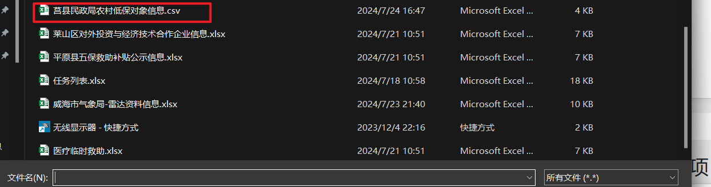

### 移动项目

1. 登录10.181.8.124服务器
2. 切换conda虚拟环境为yidong

```
conda activate yidong
```

3. 进入下面的路径

```
cd /data/xrm/xrm/code/YiDong/YiDong
```

4. 运行下面的脚本

```
 sh run.sh 
```

运行后的截图如下：


5. 打开浏览器，进入下面的地址

```
http://127.0.0.1:8008/
```


6. 选择测试文件[莒县民政局农村低保对象信息.csv]



（这里存在一些bug）


7. 点击[判断]按钮


8. 点击[移动]按钮

